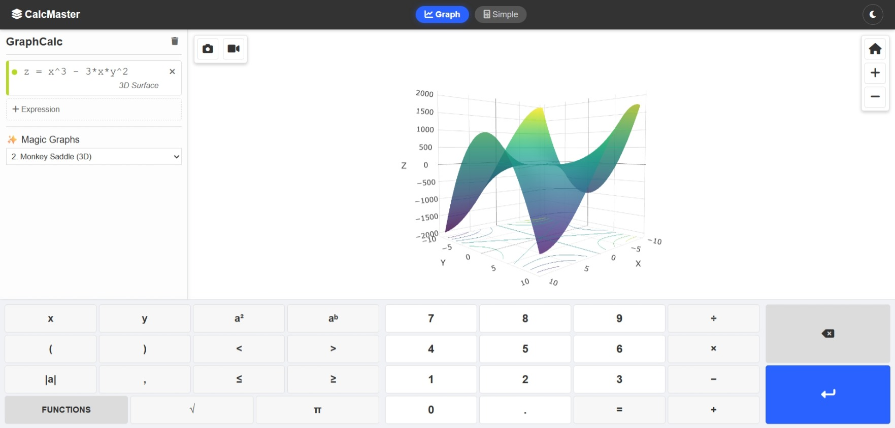
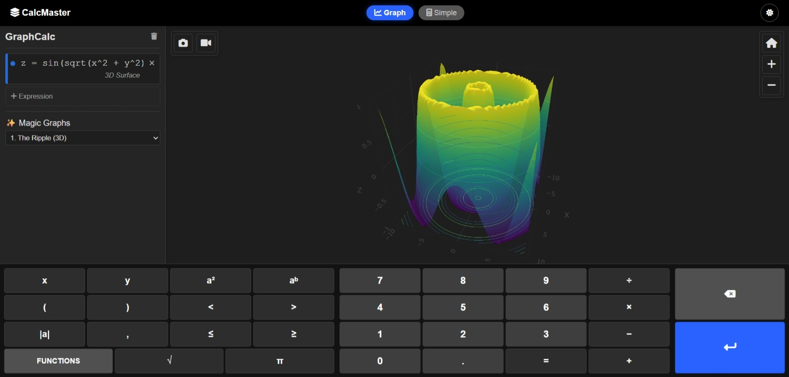
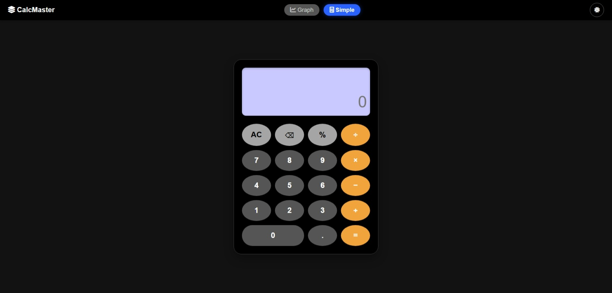

# 📉 GraphCalc Pro - Dual Mode Calculator

**GraphCalc Pro** is a powerful, web-based calculator that seamlessly bridges the gap between simple arithmetic and complex mathematical visualization. It features a dual-interface design allowing users to toggle between a standard desktop calculator and a robust 2D/3D graphing engine.

## 📸 Screenshots

Here is a look at the application in its different modes and themes.

### Graphical Mode (2D & Keypad - Light Theme)

### Simple Calculator Mode (Dark Theme)

### 3D Graphing Capability (Dark Theme)

---

## ✨ Key Features

### 📊 Graphical Mode
* **Smart Plotting:** Automatically detects and renders **2D curves** (e.g., `y = sin(x)`) and **3D surfaces** (e.g., `z = sin(x) * cos(y)`).
* **Real-Time Analysis:** As you type, it instantly calculates and displays:
    * **Roots** (x-intercepts) for 2D functions.
    * **Y-Intercepts** (`f(0)`).
    * **Arithmetic Results** (if a simple calculation like `2+2` is entered).
* **Media Tools:** Built-in controls to **Take Screenshots** 📸 and **Record Screen Videos** 🎥 of your graphs directly from the browser.
* **Magic Graphs:** A preset menu featuring 10 complex mathematical visualizations to demonstrate rendering capabilities.

### 🧮 Simple Mode
* **Clean Interface:** A distraction-free, traditional calculator layout for quick computations.
* **History Tracking:** Displays previous calculation steps above the current result.

### 🎨 UI/UX & Theming
* **Dark/Light Mode:** A global theme toggle that adjusts the entire UI for optimal visibility in any lighting.
* **Expanded Function Panel:** A comprehensive panel containing advanced functions grouped by category (Trigonometry, Statistics, Calculus, Number Theory, etc.).

---

## 🚀 How to Run

This is a client-side web application requiring no backend server.

1.  Create a new folder on your computer (e.g., `GraphCalcPro`).
2.  Inside that folder, create three empty files:
    * `index.html`
    * `style.css`
    * `script.js`
3.  **Copy and paste** the corresponding code blocks provided below into each file.
4.  **Open `index.html`** in any modern web browser (Chrome, Firefox, Edge).

---

